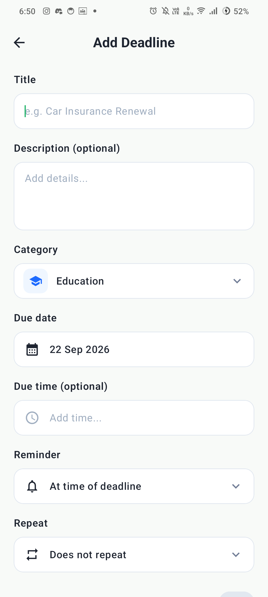
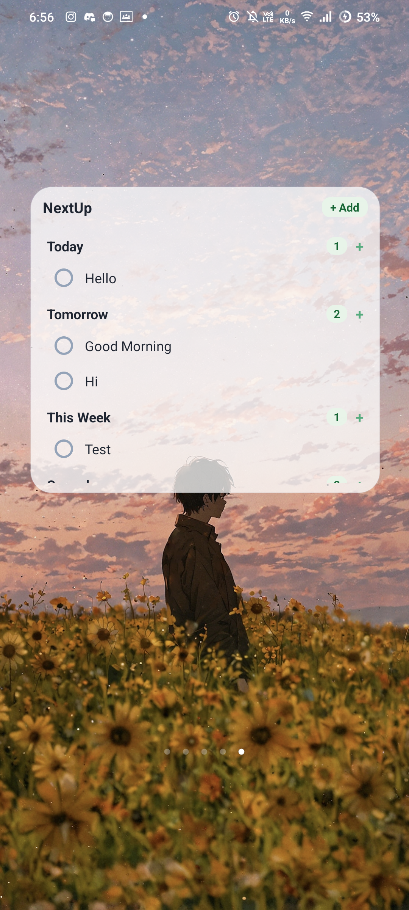

<div align="center">
  <h1>NextUp</h1>
  <p><strong>A clean, visual deadline manager for Android that helps you focus on what matters next.</strong></p>

  <p>
    
    
    
    
    
  </p>
</div>

<br />

NextUp is an offline-first Android deadline manager designed to eliminate task clutter. Instead of treating deadlines like distant calendar events or generic to-dos, NextUp organizes everything around **urgency and time horizons** — letting you know exactly what needs your attention right now.

---

## 📱 Screenshots

<p align="center">
  
  &nbsp;
  
  &nbsp;
  
  &nbsp;
  
  &nbsp;
  

  
</p>

---

## ✨ Key Features

### 📋 Smart Deadline Dashboard
- **Grouped Time Horizons**: Instant buckets for **Overdue**, **Today**, **Tomorrow**, and **This Week**.
- **Visual Urgency**: Highlights overdue deadlines with clear visual cues and time remaining.
- **One-Tap Completion**: Mark deadlines complete with smooth state animations and strikethrough styling.

### 🧩 Interactive Home Screen Widget
- **Scrollable & Minimal**: A semi-transparent frosted card designed to blend seamlessly with your wallpaper.
- **Categorized Sections**: Displays tasks under **Overdue**, **Today**, **Tomorrow**, **This Week**, and **Someday**.
- **Interactive Checkpoints**: Tap the circular dot beside any task to toggle completion directly from your home screen.
- **In-Place Quick Add & Edit**:
  - Tap section headers or the `+` button to quickly log a deadline.
  - Tap any task title to open a quick edit popup with a direct delete option.
  - Jump directly into full app edit mode with a single tap.

### 🔔 Reliable Notifications & Reminders
- **Customizable Default Time**: Defaults to **7:00 AM** for all-day deadlines, easily customizable under *Profile → Preferences*.
- **Precise Triggers**: Set exact deadline times or relative alerts (10 minutes, 1 hour, 1 day, or up to 7 days before).
- **Interactive Notifications**: Mark completed or snooze (10m, 1h, tomorrow) straight from your notification shade.
- **Reboot Resilient**: Automatically reschedules alarms after device reboot via `BootReceiver`.

### 📅 Calendar & Date Planning
- **Visual Monthly Grid**: Spot deadlines by date with marked activity dots.
- **Direct Scheduling**: Tap any calendar day to inspect its deadlines or schedule a new one directly.

### 🗂️ Categories & Subtasks
- **Built-in & Custom Categories**: Education, Work, Finance, Personal, Documents, and more.
- **Subtask Checklists**: Break down complex deadlines into trackable steps with completion progress bars.

### 🎨 Theming & Personalization
- **Dual Themes**: Switch between **Sage Green** (Nature) and **Classic Blue** seamlessly.
- **Demo & Real Data**: Built-in toggle to test the app with sample data or use the persistent Room database.
- **Ultra-Lightweight**: Release APK optimized down to ~**1.7 MB** with ProGuard / R8 code & resource shrinking.

---

## 🛠️ Architecture & Tech Stack

NextUp follows modern Android architecture guidelines with a clean unidirectional data flow (**MVVM + Repository** pattern).

```
UI Layer (Jetpack Compose / Material 3)
         ↓  StateFlow / Events
ViewModel Layer (DeadlineViewModel)
         ↓  Coroutines / Flow
Repository Layer (DeadlineRepository)
    ↙          ↘
Room DB     NotificationScheduler (AlarmManager)
```

- **Language**: Kotlin 2.0
- **UI Toolkit**: Jetpack Compose + Material Design 3
- **Local Persistence**: Room Database + KSP (Kotlin Symbol Processing)
- **Asynchrony**: Kotlin Coroutines & `StateFlow`
- **Background Scheduling**: Android `AlarmManager` with exact alarm permissions
- **Widget**: AppWidgetProvider + `RemoteViewsService` / `ListView`
- **Serialization**: Gson with ProGuard keep rules

---

## 🚀 Getting Started

### Prerequisites
- Android Studio Ladybug (or newer)
- JDK 17+
- Android device or emulator running Android 8.0 (API 26) or higher

### Build & Run
```bash
# Clone the repository
git clone https://github.com/vinish-dev/NextUp-Personal-Deadline-Manager.git
cd NextUp-Personal-Deadline-Manager

# Build Debug APK
./gradlew assembleDebug

# Run Unit Tests
./gradlew testDebugUnitTest

# Build Release APK
./gradlew assembleRelease
```

---

## 👥 Team

Built as a team project for the **Sceptix Code Jam** at **St Joseph Engineering College (SJEC)**:
- **Vinish**
- **Veol Steve Jose**
- **Shayaan**

---

## 📄 License

This project is licensed under the Apache 2.0 License.
