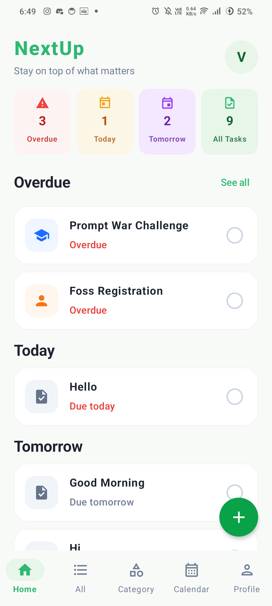
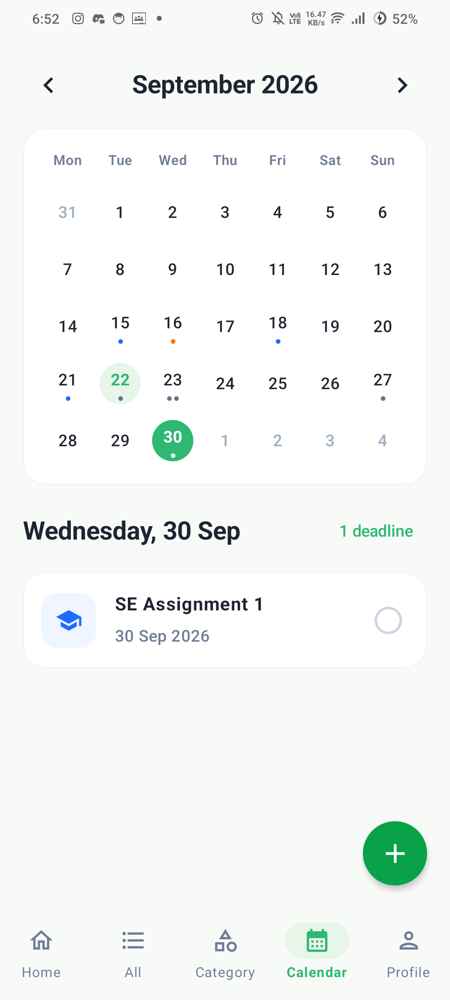
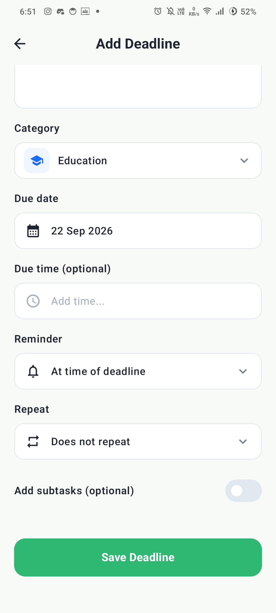
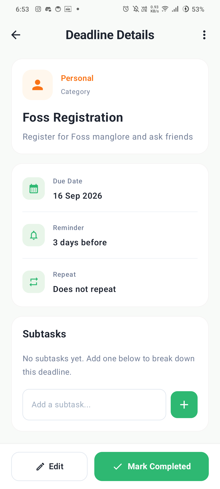

  <h1>NextUp</h1>
  
 A simple, visual deadline manager that helps you stay on top of what matters.

 
 

NextUp is an Android app designed for managing multiple deadlines in one focused place.

Instead of treating deadlines as just calendar events, NextUp organizes them around **what needs your attention next** — whether it's due today, tomorrow, or later this week.

## ✨ Features

- 📋 **Deadline Dashboard**
  - View overdue, today's, tomorrow's, and this week's deadlines at a glance
  - Quickly see priority and due time

- 📅 **Calendar View**
  - View deadlines by date
  - Select a date to see its deadlines
  - Add a deadline directly for the selected date

- ➕ **Add Deadlines**
  - Title and description
  - Category
  - Due date and optional time
  - Priority
  - Reminders
  - Recurring deadlines
  - Optional subtasks

- 🗂️ **Categories**
  - Education
  - Work
  - Finance
  - Personal
  - Documents
  - Other

- 🔔 **Reminders**
  - Set reminders before a deadline

- ✅ **Deadline Details**
  - View complete deadline information
  - Manage subtasks
  - Edit deadlines
  - Mark deadlines as completed

## 🎯 Why NextUp?

Most productivity apps are built around either tasks or calendars.

NextUp focuses specifically on **deadlines**.

The goal is to make it easy to answer one question:

> **"What deadlines do I need to care about right now?"**

The interface is designed to provide that information quickly without unnecessary clutter.

## 🛠️ Tech Stack

- **Kotlin**
- **Jetpack Compose**
- **Android**
- **MVVM Architecture**
- **Material 3**

### Architecture

NextUp follows a simple MVVM-based structure:

UI (Jetpack Compose)  
        ↓  
   ViewModel  
        ↓  
   Repository  
        ↓  
   Local Data  

The project is structured to keep UI components, data models, and application logic separated and maintainable.

## Current focus:

 - [x] App navigation and scaffold
 - [x] Home dashboard
 - [x] Deadline cards
 - [x] Add Deadline screen
 - [x] Calendar screen
 - [x] Deadline Details screen
 - [ ] Categories screen
 - [ ] Local persistence
 - [ ] Notifications
 - [ ] Search and filtering
 - [ ] Complete deadline management flow
 
## 👥 Team
- Vinish
- Veol Steve Jose
- Shayaan

Built as a team project for the Sceptix Code Jam at
St Joseph Engineering College (SJEC).

## 📱 Preview

  
  
  
  
  

